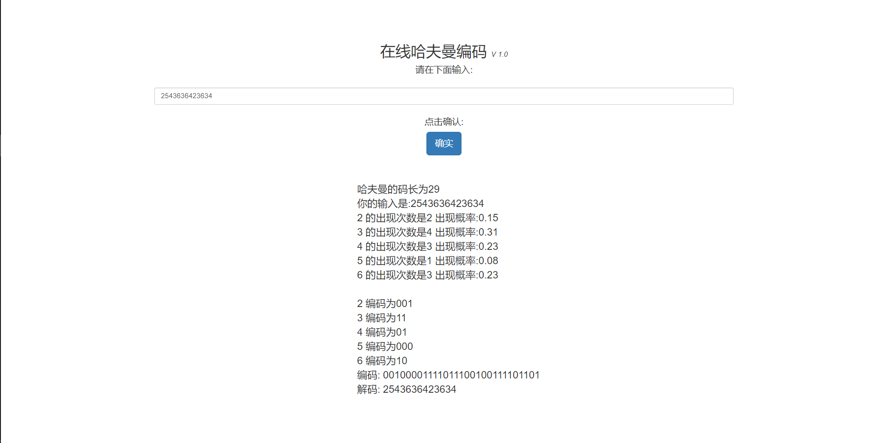
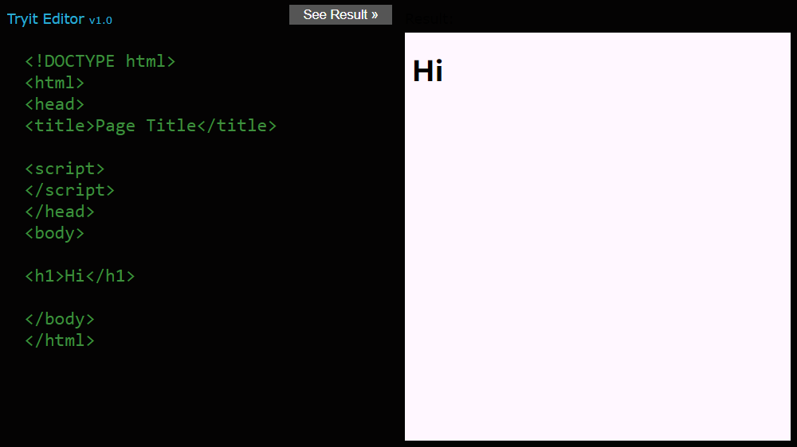
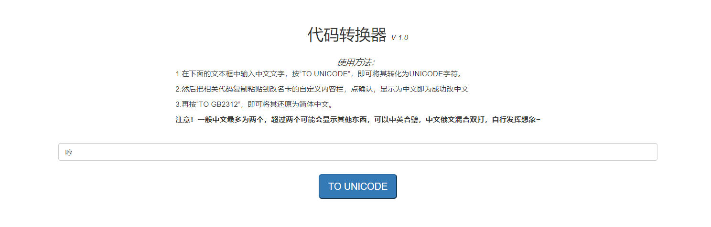
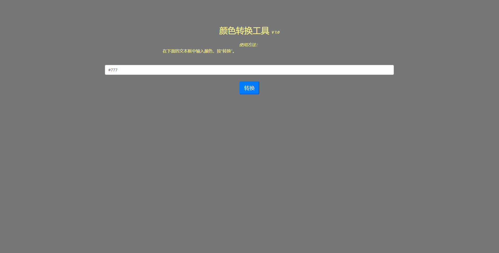

## 一些静态网页集合和一些资源的存放

--------------------------------------

这是一个很多网页的集合，多是可以展示的前端的一些东西，目的是用于不断学习的遇到的感兴趣的练习或是难点的整理。

--------------------------------------

任何问题或是批评请留言提出。

* [哈夫曼编码](https://baohangxing.github.io/hezudao/haffman.html)

* [在线js](https://baohangxing.github.io/hezudao/Tryit_Editor_v1.0.html)

>问题：1.没有代码提示 2.不是实时更新需要点击。

* [csgo中文代码转换器](https://baohangxing.github.io/hezudao/代码转换器.html)

* [YNU-INDEX](https://baohangxing.github.io/hezudao/ynu_index/bootstrap.html)

>问题很多细节没处理好其实  need more time

* [ColorShow](https://baohangxing.github.io/hezudao/ColorShow.html)

* [天地癞子生成器](https://baohangxing.github.io/hezudao/天地癞子生成器.html)

