## 有多少种不同的发送订单的方法？
SELECT COUNT(DISTINCT xorder.ship_method) FROM xorder

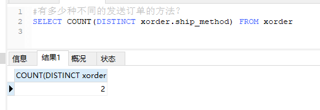

## 列出每个订单的订单id和总数量。对列表的排序以总数量为序。
SELECT DISTINCT lientem.xorderid, SUM(lientem.quantity)
FROM lientem GROUP BY lientem.xorderid
ORDER BY SUM(lientem.quantity)
 
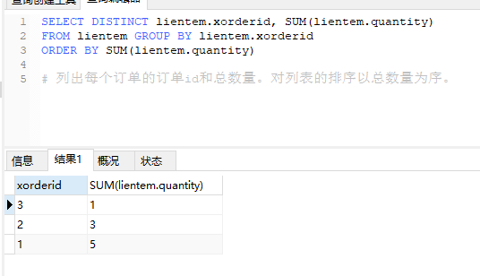
## 列出总数量大于等于4的订单id和总数量。对列表的排序以总数量为序。
SELECT DISTINCT lientem.xorderid ,SUM(lientem.quantity)
FROM lientem GROUP BY lientem.xorderid
HAVING SUM(lientem.quantity)>= 4
ORDER BY SUM(lientem.quantity)

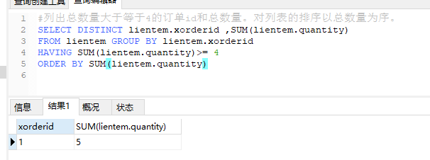

## 列出所有订单条目的订单id、售价、数量和扩展价格（售价乘以数量）。为扩展价格列使用别名“Total”。以订单id为序排序。
SELECT lientem.xorderid, sale_price , quantity, (sale_price * quantity)as "Total" 
from lientem ORDER BY lientem.xorderid

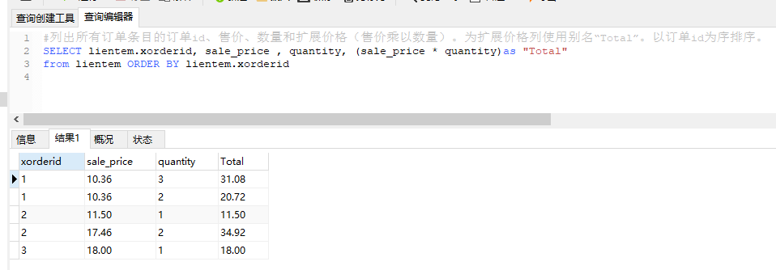

## 列出每个订单的订单id、订单日期、客户email、名、姓。先以emile为序，然后以订单日期为序。
SELECT xorder.id,xorder.clientemail,order_date,client.fname,client.Iname 
FROM xorder,client WHERE xorder.clientemail = client.email
ORDER BY xorder.clientemail , order_date;

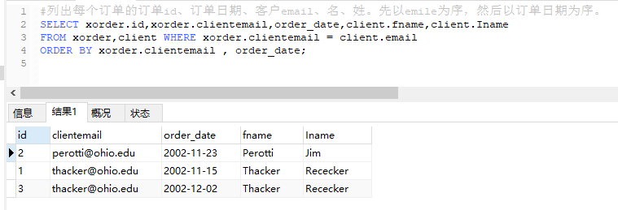

## 为每个订单列出订单id、订单日期、ISBN、标题、售价以及订单中订购的每种书的数量。以订单日期、标题为序。
SELECT xorder.id,order_date,book.isbn,title,sale_price,quantity
FROM xorder,book, lientem WHERE lientem.xorderid = xorder.id AND
lientem.bookisbn = book.isbn ORDER BY order_date, title;

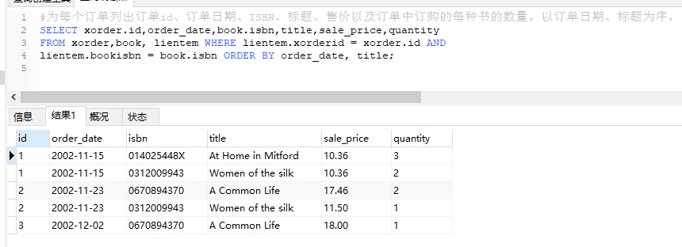

## 为每个订单列出订单id、订单日期、客户email、名、姓以及订单中包含的每种书的ISBN、标题、售价、数量。以订单id、标题为序。
SELECT xorder.id,order_date,xorder.clientemail,client.fname,client.Iname,book.isbn,title,
sale_price,quantity FROM xorder,book,lientem,client WHERE xorder.clientemail = client.email AND 
lientem.xorderid = xorder.id AND lientem.bookisbn = book.isbn ORDER BY xorder.id , title;

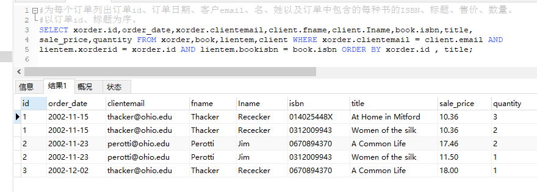

## 为俄亥俄州（OH）的客户填写的每个订单列出订单id、订单日期、客户email、名、姓以及订单中包含的每种数的ISBN、标题、售价、数量。以订单id、标题为序。
SELECT xorder.id,order_date,xorder.clientemail,client.fname,client.Iname,book.isbn,title,
sale_price,quantity FROM xorder,book,lientem,client WHERE xorder.clientemail = client.email AND 
lientem.xorderid = xorder.id AND lientem.bookisbn = book.isbn AND state = "oh" 
ORDER BY xorder.id , title;

## 为订购ISBN为014025448X或0670894370的每个订单列出订单id、订单日期客户email、名、姓以及订单中包含的每种书的ISBN、标题、售价、数量。以订单日期、标题为序。
SELECT xorder.id,order_date,xorder.clientemail,client.fname,client.Iname,book.isbn,title,
sale_price,quantity FROM xorder,book,lientem,client WHERE  lientem.xorderid = xorder.id
AND xorder.clientemail = client.email AND (book.isbn = '014025448X' or book.isbn = '0670894370')
AND lientem.bookisbn = book.isbn ORDER BY xorder.id , title;

## 列出由Nationwide保险的每个病人的名、姓、邮政编码，以病人的姓为序。
SELECT fname, Iname ,zip FROM patient , insure WHERE insure.insurancescompany='Nationwide'
AND patient.id = insure.patientid ORDER BY Iname;

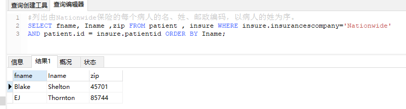

## 列出居住在俄亥俄州或肯塔基州的每个病人的名、姓、州、邮政编码以及该病人投保的保险公司的名字和电话号码，以病人的姓为序
SELECT fname, Iname ,state,zip , insurancescompany, insurance.phone FROM patient , insurance, insure 
WHERE (state = "oh" OR state = "ky") AND patient.id = insure.patientid AND
insure.insurancescompany = insurance.company ORDER BY Iname;

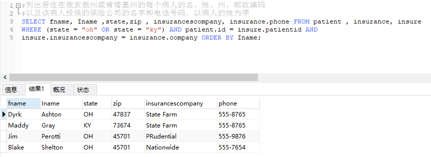

## 列出每个保险公司的名字、联系人的名和姓以及在该保险公司投保的所有病人的id、名、姓。以保险公司、病人的姓为序。
SELECT insurance.company, contact_fname, contact_Lname, patient.id , patient.fname,patient.Iname
from patient, insurance, insure WHERE insurance.company = insure.insurancescompany AND
patient.id = insure.patientid ORDER BY insurance.company, patient.Iname

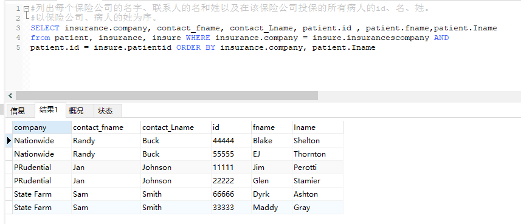

## 列出每个病人的名和姓、病人医生的名和姓、病人投保的保险公司的名字和电话号码，以保险公司、医生的姓、病人的姓为序。
SELECT patient.fname AS patient_fname,patient.Iname AS patient_Iname ,
doctor.fname AS doctor_fname, doctor.Iname AS doctor_Iname, 
insurance.company AS insurances_company, insurance.phone
from patient, doctor, insurance, insure WHERE doctor.id =patient.doctorid AND 
insurance.company = insure.insurancescompany AND
patient.id = insure.patientid ORDER BY insurance.company, doctor.Iname,patient.Iname

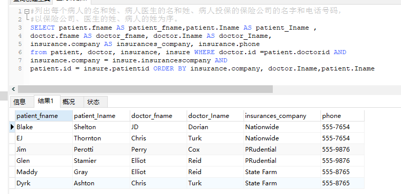

## 列出id为11111、33333或55555的病人的名和姓、病人医生的名和姓、病人投保的保险公司的名字和电话号码。以保险公司、医生的姓、病人的姓为序。
SELECT patient.fname AS patient_fname,patient.Iname AS patient_Iname ,
doctor.fname AS doctor_fname, doctor.Iname AS doctor_Iname, 
insurance.company AS insurances_company, insurance.phone
from patient, doctor, insurance, insure WHERE doctor.id =patient.doctorid AND 
(patient.id = "11111" OR patient.id = "33333" OR patient.id = "55555" ) AND
insurance.company = insure.insurancescompany AND
patient.id = insure.patientid ORDER BY insurance.company, doctor.Iname,patient.Iname

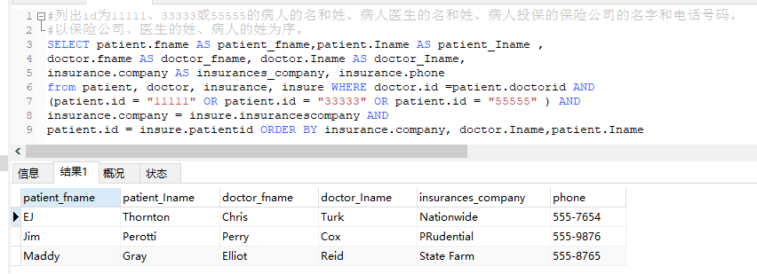

## 列出没有分配到任何病人的医生的id号、名和姓。以医生的姓为序。
SELECT DISTINCT doctor.id, doctor.fname, doctor.Iname FROM doctor
WHERE doctor.id not in (SELECT doctorid FROM patient) ORDER BY doctor.Iname;

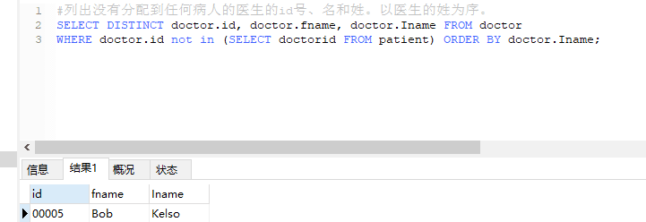

## 有多少填写订单的不同客户？
SELECT COUNT(DISTINCT customerid) FROM xorder;

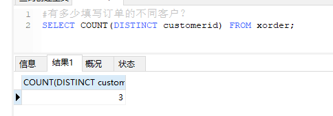

## 列出填写了多于一个订单的客户的名和姓。
SELECT fname AS customer_fname, Iname AS customer_iname FROM customer
WHERE customer.id in (SELECT customerid FROM xorder GROUP BY customerid)
HAVING COUNT( customer.id > 1);

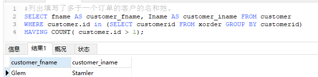

## 列出包含在超过一个订单中的所有商品的商品id、订购数量。以商品id的降序为序。
SELECT productid, SUM(quanitity) FROM lineitem
GROUP BY productid HAVING COUNT(productid)>1
ORDER BY productid DESC

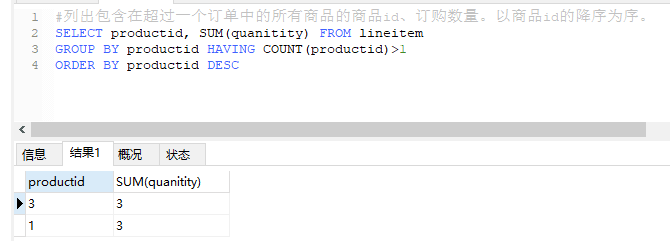

## 已经的订单有多少？
SELECT COUNT(xorder.id) FROM xorder WHERE delivery ="y";

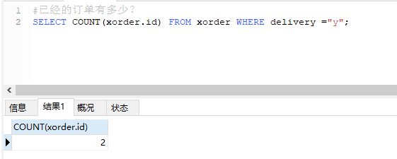

## 列出没有填写过订单的所有客户的名和姓。以姓为序。
SELECT fname, Iname FROM customer WHERE customer.id NOT in 
(SELECT customerid FROM xorder) ORDER BY Iname;

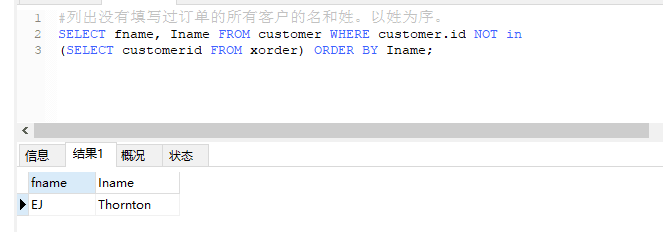

## 列出订单中现在包括的商品的id、订价和描述。以订价的降序为序。
SELECT DISTINCT product.id, list_price, description
FROM product, lineitem WHERE product.id = lineitem.productid
ORDER BY list_price DESC

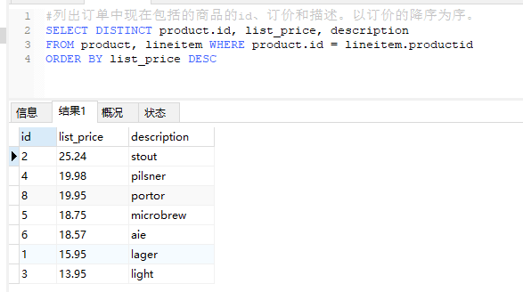

## 列出订单中现在没有包括的商品的id、订价和描述。以订价的降序为序。
SELECT DISTINCT product.id, list_price, description
FROM product WHERE product.id NOT in (SELECT productid FROM lineitem)
ORDER BY list_price DESC

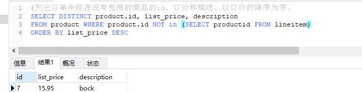

## 列出订价大于所有商品定价平均值的商品id、描述和订价。以描述为序。
SELECT product.id, list_price, description FROM product 
WHERE list_price > (SELECT AVG(list_price) FROM product)
ORDER BY description

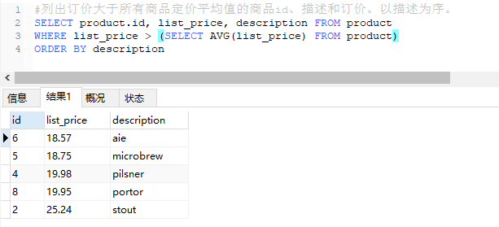
